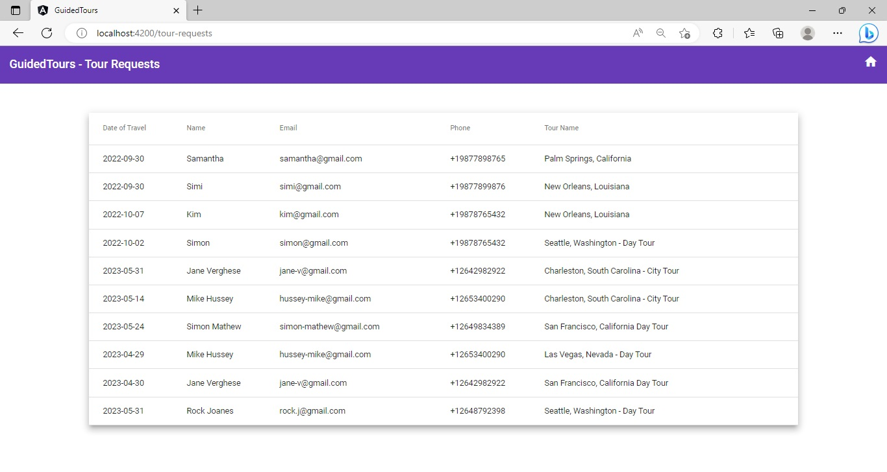

## Practice :: Guard Routes in an Angular Application

This sprint has 1 practice.

### Points to Remember

- Use the `CanActivate` route guard to restrict access to protect the views.
- Use the `CanDeactivate` route guard to seek confirmation from the user before leaving the view with unsaved changes.

### Instructions for Practice

- Fork the boilerplate into your own workspace. ​​​
- Clone the boilerplate into your local system. ​​​
- Open command terminal and set the path to the folder containing the cloned boilerplate code.​​​
- Run the command `npm install` to install the dependencies.​
- Open the folder containing the boilerplate code in `VS Code`.​​

Notes:​

1. The solution of this practice will undergo an automated evaluation on the `CodeReview` platform. (Local testing is recommended prior to testing on the `CodeReview` platform)​
2. The test cases are available in the boilerplate.

### Context

`GuidedTours` is a popular tour operator service in the United States of America. This tour operator conducts day tours with tour guides to various popular tourist destinations within the select states. Each tour offered allows the tourists to view the popular sites in a particular city. A tour could be for one or more days.

Recently, the tour operator has got a web application developed by the name GuidedTours. This application will help them increase their online presence and enhance the business. 

The application provides details of various tours available along with a personal guide. The application allows the users to make online requests for the tours of their choice. 

The tour guide can view all the requests made online for the tours. 

The developers of this application must now refactor the code to ensure that:
- Only the tour guides are allowed to view the submitted requests.
- The application does not leave the view that accepts tour requests with unsaved changes without the confirmation from the user.

### About the Code and Data File​
- The boilerplate code contains a route-enabled solution for the `GuidedTours` application.
    - The components in the application are styled using Angular Material components and themes.
- It also contains the folder im`ages which has image files required by this application. 
- The tour data is saved in the file `guided-tours.json` that is in the folder `guided-tours-data` of the boilerplate.
    - Start the `json-server` with the parameter `guided-tours.json` passed to the command `json-server` to access data.

#### Landing View – Hero Unit


#### Landing View – Tour List


#### Tour-Cart View (Before Submitting Details)


#### Landing View (After Submitting Details)


#### Tour-Requests View


### Problem Statement

In the existing solution of the `GuidedTours` application, implement route guards to ensure the following:

- The tour requests made online by the users should only be accessible to the registered tour guide.
- The application should seek confirmation from the users if they leave the tour-request view without submitting the request.

​Note: The tasks to guard routes in the application are given below:

#### Task 1: Add AuthService 

- Step 1: Run the following command to add a service with the name `auth` to the application:

    `ng generate service services/auth or ng g s services/auth`
- Step 2: In the `AuthService` class, add a `Boolean` property `isLoggedIn` and initialize it with the value `false`.
- Step 3: In the same class, add the `login()` method.
    - The method should accept a string parameter `tourGuideCode`.
    - The method should compare the value of the parameter to the value TG@`2022` and assign the result of the comparison to the `isLoggedIn` variable.`

Notes: 
1. The code snippet for the above steps are given in the upcoming slide.
2. The focus of the code is on guarding routes. Hence, a dummy tour guide code is given without any password.

    
- Step 4: In the same class, add the `logout()` method that assigns the value `false` to the `isLoggedIn` property. (Refer to the code given below)

    ```typescript
        isLoggedIn: boolean = false;

        login(tourGuideCode: string) {
            this.isLoggedIn = tourGuideCode === "TG@2022";
        }

        logout() {
            this.isLoggedIn = false;
        }
    ```
#### Task 2: Add `LoginComponent`
- Step 1: Create a component with the name `login` using the Angular CLI command: (Refer to the command given below)​

	`ng generate component login or ng g c login`
- Step 2: In the `AppRoutingModule`, to the `Routes` array, add route definition for routing to the `LoginComponent`. (Refer to the code given below)​
    ```typescript
        { path: "login", component: LoginComponent }
    ```
- Step 3: In the `RouteService`, add a new method `navigateToLoginView()` that allows navigation to the login view. (Refer to the code given below)​
    ```typescript
        navigateToLoginView() {
            this.router.navigate(["login"]);
        }
    ``` 
- Step 4: Inject `AuthService` and `RouteService` into the constructor of the `LoginComponent`.
    ```typescript
        constructor(private authService: AuthService, private routeService: RouteService) { }
    ```
- Step 5: Define a string property `tourGuideCode` in the `LoginComponent` and initialize it with an empty string.
- Step 6: In the `LoginComponent`, add the `validateTourGuideCode()` method to validate the entered `tourGuideCode` value.
    - Pass the `tourGuideCode` value to the `login()` method of the `AuthService`.
    - If the `login()` method returns `true`, call the `navigateToTourRequestsView()` method of the `RouteService`. (Refer to the code given below)​

    ```ts
        validateTourGuideCode() {
            this.authService.login(this.tourGuideCode);
            if(this.authService.isLoggedIn) {
                this.routeService.navigateToTourRequestsView();
            }
        }
    ```
- Step 7: In the template of the `LoginComponent`, add an input field to accept the tour-guide code and a button that calls the `validateTourGuideCode()` method when clicked.
- Step 8: In the same template, add link to allow the users to route to `home` view which displays the available tours. (Refer to the code given below)

    ```html
        <mat-toolbar id="header" color="primary">
            <h1>GuidedTours</h1>
        </mat-toolbar>
        <div id="login-form">
            <h3>If you are a Tour Guide, enter your Tour Guide Code</h3>
            <mat-form-field appearance="legacy">
                <mat-label>Enter Tour Guide Code</mat-label>
                <input matInput name="tourGuideCode" [(ngModel)]="tourGuideCode" placeholder="Tour Guide Code">
            </mat-form-field>
            <button mat-button color="primary" (click)="validateTourGuideCode()">Submit</button>
            <h3>If you are a Visitor, <a routerLink="">click here</a></h3>
        </div>
    ```
- Step 9: Add the following style code for the LoginComponent. (Refer to the code given below)
    ```css
        #login-form {
            max-width: 400px;
            margin: auto;
            margin-top: 100px;
        }
    ```

##### Expected Output - Login View


#### Task 3: Create `CanActivate` Route Guard

- Step 1: Run the following command to create a `CanActivate` route guard:

    `ng generate guard services/auth` or `ng g g services/auth`
- Step 2: Inject `AuthService` and `RouteService` to the `AuthGuard`. (Refer to the code given below)
    ```ts
        constructor(private authService: AuthService, ​
                    private routeService: RouteService){}​
    ```
- Step 3: Implement the `canActivate()` method of the `CanActivate` guard to check the value of the `isLoggedIn` property of the `AuthService`.
    - If the value of the `isLoggedIn` property is `true`, the `canActivate()` method should return the value `true`.
    - If the value of the `isLoggedIn` property is `false`, the `canActivate()` method should call the `navigateToLoginView()` method of the `RouteService` and return the value `false`. (Refer to the code given below)

    ```ts
        canActivate(
            route: ActivatedRouteSnapshot,
            state: RouterStateSnapshot): Observable<boolean | UrlTree> | Promise<boolean | UrlTree> | boolean | UrlTree {
            if(!this.authService.isLoggedIn){
                this.routeService.navigateToLoginView();
                return false;
            }
            else
                return true;
        }
    ```
#### Task 4: Add `CanActivate` Route Guard

- Step 1: Add the `AuthGuard` to the route with path `tour-requests` in the `app-routing.module.ts` file.

    ```ts
        const routes: Routes = [
            { path: "login", component: LoginComponent },
            { path: "", component: HomeComponent },
            { path: "tour-cart/:id", component: TourCartComponent },
            { path: "tour-requests", component: TourRequestsComponent, canActivate: [AuthGuard] },
            { path: "**", component: NotFoundComponent }
        ];
    ```
- Perform the following steps to test the `AuthGuard`:
    - Run the application. `Home` view should get launched.
    - In the address bar of browser, type the URL `http://localhost:4200/tour-requests`.
        - The application should navigate to the `login` view.
        - Input the `tourGuideCode` and click on submit.
        - For the valid tour guide code (`TG@2022`), the application will navigate the users to `TourRequests` view.

#### Task 5: Create `CanDeactivate` Route Guard
- Step 1: Run the following command to create the `CanDeactivate` guard:

  `ng generate guard can-deactivate` or `ng g g can-deactivate`

- Step 2: In the `CanDeactivate` route guard class:
    - Replace `CanDeactivateComponent` with `TourCartComponent`.
    - The type of `component` parameter in the `canDeactivate()` method should be changed to `TourCartComponent`.

- Step 3: The `canDeactivate()` method of this guard should check whether the component contains definition of the `canDeactivate()` method.
    - If `true`, the `canDeactivate()` method of the `TourCartComponent` must be called and its value must be returned.
    - If `false`, value `true` must be returned. (Refer to the code given below)

```ts
canDeactivate(
    component: TourCartComponent,
    currentRoute: ActivatedRouteSnapshot,
    currentState: RouterStateSnapshot,
    nextState?: RouterStateSnapshot): Observable<boolean | UrlTree> | Promise<boolean | UrlTree> | boolean | UrlTree {
    return component.canDeactivate ? component.canDeactivate() : true;
}
```
- Step 4: Add the `CanDeactivateGuard` to the path for the `TourCartComponent` in the route configuration. (Refer to the code given below)

    ```ts
        { path: "tour-cart/:id", component: TourCartComponent, canDeactivate:[CanDeactivateGuard] }
    ```
- Step 5: Refactor the `TourCartComponent` to implement the confirmation workflow for the tour requests that were not submitted. Do the following to refactor:
    - Add a `boolean` property `submitStatus` initialized with the value `false`.
    - Define the `canDeactivate()` method, which checks for the value of `submitStatus` property.
    - If the value is not `true`, it should call the JavaScript function `confirm()` to take confirmation from the user for leaving the view with unsaved changes.
    - If the value is `true`, the value `true` must be returned. (Refer to the code given below)

        ```ts
              canDeactivate() {
                if (!this.submitStatus)
                    this.submitStatus = confirm("You have not submitted a request to this tour. Any details entered will be lost. Are you sure you want to leave?");
                return this.submitStatus;
            }
        ```
- Step 6: Set the `submitStatus` property to false after the component initializes and fetches the tour details for the `id` read from the route. (Refer to the code given below)

        ```ts
            ngOnInit(): void {
                this.activatedRoute.paramMap.subscribe(param => {
                    let id = param.get("id") ?? "";
                    this.tourService.getTour(id).subscribe(data => {
                        this.tour = data;
                        this.stars = new Array(this.tour.rating);
                        this.submitStatus = false;
                    })
                })
            }
        ```
- Step 7: Set the `submitStatus` property to `true` in the `makeRequest()` method after the changes have been saved to the server. (Refer to the code given below)
        ```ts
            makeRequest() {
                if (this.tourRequest.customerName && this.tourRequest.customerEmail && this.tourRequest.customerPhone && this.tourRequest.dateOfTravel) {
                    this.tourRequest.tourName = this.tour?.tourName;
                    this.tourRequestService.saveTourRequest(this.tourRequest).subscribe({
                    next: data => {
                        this.snackBar.open("Request Submitted", "", {
                        duration: 3000
                        });
                        this.submitStatus = true;
                        this.routeService.navigateToHomeView();
                    },
                    error: err => {
                        alert(err);
                    }
                    });
                }
                }
        ```
- Step 8: Perform the following steps to test the workings of the CanDeactivate guard:
    - Run the application.
    - Click on the `cart` icon of any tour listed on the `home` view.
    - The application navigates to the `TourCartComponent`.
    - Click on the `home` icon on the toolbar of the page:
        - The application should show a confirmation box seeking confirmation from the user to leave the view without submitting the request.
            - If the user confirms, the application navigates to the `home` view.
            - Else, the user stays on the `TourCart` view.
    - Go to the `home` view and again click on the `cart` icon of any tour listed on the `home` view.
    - Fill up the details for the displayed tour on the `TourCart` view:
    - Click on `Make Request` button, user should be navigated to the `home` view and a notification gets displayed with the message, `Request Submitted`.

##### Expected Output - Login View


### Test the Solution Locally​
Test the solution first locally and then on the `CodeReview` platform. Steps to test the code locally are:
- From the command line terminal, set the path to the folder containing cloned boilerplate code.
- Run the command `ng test` or `npm run test` to test the solution locally and ensure all the test cases pass.
- Refactor the solution code if the test cases are failing and do a re-run.​
- Finally, push the solution to git for automated testing on the CodeReview platform.

### Test the Solution on the `CodeReview` Platform
Steps to test the code on the `CodeReview` platform are:
- Open the submission page at [https://codereview.stackroute.niit.com/#/submission](https://codereview.stackroute.niit.com/#/submission).
- Submit the solution.
- For the failed test cases, refactor the code locally and submit it for re-evaluation.